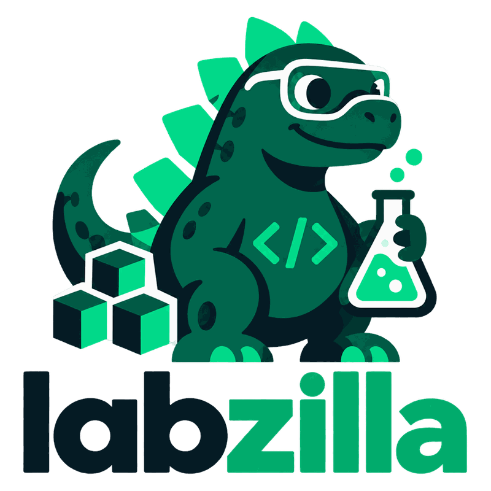

<p align="center">
  <picture>
    <source media="(prefers-color-scheme: dark)" srcset="assets/brand/labzilla-logo-dark.png">
    <source media="(prefers-color-scheme: light)" srcset="assets/brand/labzilla-logo.png">
    
  </picture>
</p>

<p align="center">
  <b>One machine. One cluster. One very large lizard.</b><br>
  <sub>The infrastructure and private AI platform behind <code>tiny-dgx</code>, a DGX Spark (GB10, arm64, 128 GB unified memory).</sub>
</p>

<p align="center">
  
  
  
  
</p>

---

labzilla is a monorepo with two projects that share one host, one cluster and one set of
local credentials:

| Project | What it is | Start here |
|---|---|---|
| **[`homelab/`](homelab/)** | The k3s platform: Longhorn storage, MinIO backups (on- and off-site), Prometheus + Grafana, MetalLB, Tailscale, all GitOps-managed by Argo CD | [homelab/README.md](homelab/README.md) |
| **[`lif/`](lif/)** | The **Local Intelligence Fabric**: an OpenAI-compatible gateway over local models, a Decision Fabric, model lifecycle, batch queue, and a Control Center UI. Runs on the platform | [lif/README.md](lif/README.md) |

## Repository map

```text
labzilla/
├── homelab/            k3s platform (Argo CD app-of-apps, Helm values, host prep, backup)
│   ├── argocd/         root.yaml → apps/   (a push to main is a deploy)
│   ├── monitoring/     Prometheus/Grafana values, rules, dashboards
│   ├── networking/     MetalLB, Tailscale
│   ├── longhorn/  minio/  backup/  host/
│   ├── scripts/        every setup step, repeatable
│   └── docs/
├── lif/                Local Intelligence Fabric
│   ├── lif/            Python package (gateway, controller, decision, batch, cli, …)
│   ├── deploy/k8s/     manifests (kustomization.yaml at lif/)
│   ├── config/ evals/  apps/control-center/
│   ├── benchmarks/     public, reproducible benchmarks
│   ├── knowledge/      agent repos + knowledge package registry (typed Markdown; `knowledge` CLI, MCP)
│   ├── tests/
│   └── docs/
├── assets/brand/       logo (light + dark), mark, social card
├── tools/              setup.sh, check-private.py (the public-repo guard)
├── .githooks/          pre-commit → tools/check-private.py
│
├── secrets/            🔒 credentials          (git-ignored, README only)
├── private/            🔒 sensitive docs/data  (git-ignored, README only)
├── personal/           🔒 your notes           (git-ignored, README only)
└── .env.local          🔒 TYPE_SAFE_JEV_API_KEY (git-ignored)
```

## Quickstart

```bash
git clone git@github.com:MoRohn/labzilla.git ~/labzilla && cd ~/labzilla
tools/setup.sh            # enables the pre-commit guard, creates the private roots, builds lif/.venv
```

Then follow the project you need:

- **Platform from scratch:** [homelab/README.md → "The setup, in seven acts"](homelab/README.md#the-setup-in-seven-acts)
- **Deploy or operate LIF:** [lif/docs/DEPLOYMENT.md](lif/docs/DEPLOYMENT.md) and [lif/docs/OPERATIONS.md](lif/docs/OPERATIONS.md)
- **Call the AI gateway from an app:** [lif/README.md → Quickstart](lif/README.md#quickstart-for-application-developers)

## How changes reach the cluster

| What changed | How it deploys |
|---|---|
| `homelab/argocd/apps/**`, `homelab/monitoring/**`, `homelab/networking/metallb/config/**` | **Push to `main`.** Argo CD syncs within ~3 minutes |
| `lif/**` | By hand: build → push to the local registry → `kubectl apply` ([DEPLOYMENT](lif/docs/DEPLOYMENT.md)). An optional Argo CD app is in `homelab/argocd/templates/` |
| Host prep, Helm installs, secrets | Scripts in `homelab/scripts/`, `homelab/host/`, `lif/scripts/` |

`main` is production. Review before you push.

## What stays private

This repository is **public**. Three git-ignored roots keep everything else on the machine:

| Root | For | Examples |
|---|---|---|
| [`secrets/`](secrets/README.md) | Credentials | MinIO, Grafana, Tailscale, off-site env files; LIF API keys |
| [`private/`](private/README.md) | Real project material that must not be published | LIF host/network audit, security posture, primary-workload integration, production readiness, benchmarks captured from production |
| [`personal/`](personal/README.md) | Your own notes | Notes, drafts, diagnostics, saved AI-assistant memory or reasoning |

Three layers back this up:

1. **`.gitignore`** ignores each root wholesale. Only its README is tracked, so a new file is private by default.
2. **The pre-commit guard** ([`tools/check-private.py`](tools/check-private.py)) rejects staged files that sit in a private root, look like keys or dotenv files, contain any credential currently stored in `secrets/` or `.env.local`, or match well-known token formats. It never prints the values.
3. **`python3 tools/check-private.py --all`** audits every tracked file. Run it before a push.

Public docs that refer to private ones mark the link *(private, local only)*.
Claude Code's own memory and transcripts live in `~/.claude/`, outside the repo.

## Conventions

- **Commits:** Conventional Commits with a scope: `feat(monitoring): …`, `fix(lif): …`, `docs(homelab): …`.
- **Pin everything:** Helm chart versions, image tags, Python dependencies.
- **Scripts** are idempotent, run from their project folder, and find `secrets/` at the repo root.
- **Memory is shared:** the GPU and every pod draw from one 128 GB pool. Give every workload limits.
  Talk to the host GPU scheduler (`gpusched`) before using the GPU.
- **AI assistants:** see [CLAUDE.md](CLAUDE.md) for the rules agents follow in this repo.

---

<p align="center">
  <br>
  <sub>Stomping on single points of failure since 2026. (Except the one node. We don't talk about the one node.)</sub>
</p>
