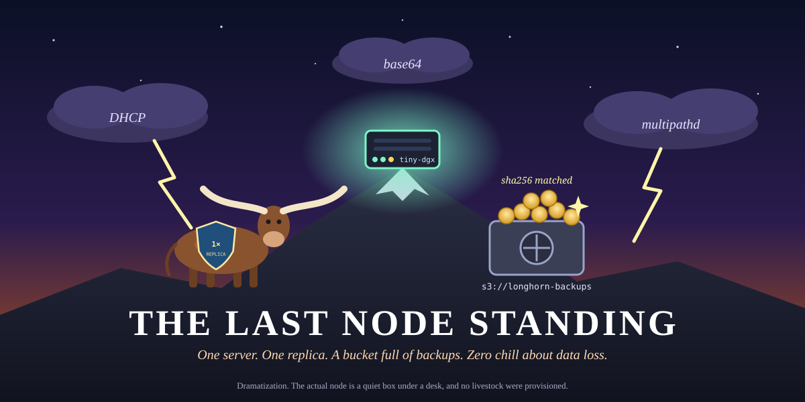

# homelab-k3s

<p align="center">
  
</p>

> *In a world of multi-region, multi-zone, multi-everything clusters, one machine dared to ask:
> "What if there was just… me?"*

This is the infrastructure for a **single-node k3s cluster** on `tiny-dgx` (192.168.68.72).
It runs **Longhorn** for block storage and backs everything up to **MinIO**, because a
homelab without backups is just an elaborate way to lose data.

The whole thing is scripted, version-pinned, and was tested by deliberately backing up and
restoring 50 MiB of random noise. The checksums matched. Nobody cried.

---

## The legend so far

Every great saga has trials. This one had:

| Trial | Villain | How it was defeated |
|---|---|---|
| I | `permission denied` on `/etc/rancher/k3s/k3s.yaml` | Copied the kubeconfig home, where it belongs |
| II | `illegal base64 data at input byte 0` | Discovered `stringData:`, the field that accepts plain text |
| III | `illegal base64 data at input byte 16` | Learned that 17 characters is not a valid base64 string, no matter how confidently it's typed |
| IV | MinIO listening only to itself on `127.0.0.1` | Gave it a second ear on the LAN |
| V | `multipathd`, the device thief | Blacklisted, politely but firmly |
| VI | Three copies of everything on a cluster of one | Reduced to one copy each, reclaiming ~160 MiB of memory |
| VII | 134,000 time series, most of them duplicates | k3s runs the whole control plane in one process, so its metrics arrive twice. Trimmed to ~19,000 |
| VIII | Grafana, OOM-killed while admiring its own dashboard | Evicted its two sidecars and gave it room to breathe |
| IX | node-exporter, vanishing one scrape in five | Bisected 49 collectors to one: `cpufreq`, stuck in firmware calls on the GB10. Disabled |
| X | A backup job that would faithfully copy an empty bucket over the only spare | Taught it to refuse, and to keep everything it replaces for 30 days |

The node remains standing. Details below, for those who prefer facts to folklore.

---

## What lives where

| Path | What it holds |
|---|---|
| `host/` | One-time host prep. Needs sudo, like all things worth doing |
| `longhorn/values.yaml` | Longhorn Helm values, pinned to chart 1.13.0 |
| `minio/` | MinIO policies: the backup user and the metrics-only scraper |
| `argocd/` | Argo CD app-of-apps. Push to `main` and the cluster follows |
| `monitoring/` | Prometheus + Grafana values, scrape configs, alert rules, dashboards |
| `networking/` | MetalLB address pools and the Tailscale operator |
| `backup/` | Off-site copy of Longhorn backups (rclone over SFTP, hourly timer) |
| `scripts/` | Every setup step, repeatable on demand |
| `docs/` | Reference docs, plus the poster above |
| `secrets/` | Local credentials. Git-ignored. Never leaves the machine |
| `personal/` | Notes and drafts. Also git-ignored. Also never leaves |

---

## The setup, in seven acts

**Act 1: Gain access.** Copy `/etc/rancher/k3s/k3s.yaml` to `~/.kube/config`, make yourself
the owner, and add `export KUBECONFIG=~/.kube/config` to `~/.bashrc`. k3s's kubectl looks in
`/etc` by default and will not take a hint.

**Act 2: Prepare the host.**

```bash
sudo host/prep-longhorn.sh
```

This starts `iscsid`, loads `iscsi_tcp`, and tells `multipathd` to stop claiming disks that
aren't its own. All three changes survive reboots.

**Act 3: Let MinIO hear the cluster.** MinIO runs in the separate bnn Docker stack, not in
k3s. See [docs/minio.md](docs/minio.md) for the port binding and the one restart rule you
must never forget.

**Act 4: Build the vault.**

```bash
scripts/setup-minio-bucket.sh
```

This creates the `longhorn-backups` bucket and a `longhorn` user who can touch that bucket and
absolutely nothing else. The generated password goes straight into `secrets/`.

**Act 5: Summon Longhorn.**

```bash
scripts/install-longhorn.sh
```

This creates the `minio-credentials` secret, installs Longhorn with the backup target already
configured, and waits until every pod reports for duty.

**Act 6: Trust, but verify.**

```bash
kubectl -n longhorn-system get backuptargets.longhorn.io   # AVAILABLE should be true
kubectl get sc                                               # local-path (default) + longhorn
```

**Act 7: The trial by fire.**

```bash
scripts/test-backup.sh
```

This writes 50 MiB of random data to a Longhorn volume, backs it up to MinIO, restores it to a
brand-new volume, and compares SHA-256 checksums. Then it cleans up after itself. It is the
most well-mannered script in the repository.

---

## The watchtower (monitoring)

Prometheus and Grafana, deployed by **Argo CD** straight from this repo. Change a file,
push to `main`, and within about three minutes the cluster has caught up. No `kubectl apply`
required, no ceremony.

```bash
scripts/setup-minio-metrics.sh    # once: metrics-only MinIO user + token
scripts/install-monitoring.sh     # once: secrets Argo can't hold, then hand over to Argo CD
```

Open Grafana (it's deliberately not on the network):

```bash
kubectl -n monitoring port-forward svc/monitoring-grafana 3000:80   # http://localhost:3000
```

The login is in `secrets/grafana.env`. You land on **Homelab Overview**, the home dashboard,
which answers the only questions that matter at a glance: is the node up, how much unified
memory is left for the GPU, are the backups healthy, and is anything on fire. Four more
curated folders sit behind the **Dashboards** menu:

| Folder | Dashboards |
|---|---|
| Homelab | Homelab Overview (generated by `monitoring/dashboards/src/homelab_overview.py`) |
| Kubernetes | Kubernetes Views: Global, Namespaces, Nodes, Pods |
| Node | Node Exporter Full |
| Storage | Longhorn Monitoring & Backups |

What's watched: the node, Kubernetes, Longhorn, MinIO (outside the cluster), and the bnn GPU
scheduler. Alert rules live in `monitoring/extras/homelab-rules.yaml` and show up on the
overview. Nothing pages you at 3 a.m., by design.

The whole stack runs lean: about 0.8–1 GiB, with hard limits on every component, because on
this machine the monitoring and the GPU share the same memory.

To update the community dashboards: bump a revision in `scripts/fetch-dashboards.sh` and run it.
To change the home dashboard: edit the generator, run it, commit both files.

---

## The roads in (networking)

**MetalLB** hands out LoadBalancer addresses, replacing k3s's built-in ServiceLB.
Traefik is pinned to the node's own address, `192.168.68.72`, so everything that already
pointed there keeps working. A second, opt-in pool (`192.168.71.230-239`) is ready for any
service that wants an address of its own:

```yaml
metadata:
  annotations:
    metallb.io/address-pool: lan
```

**Tailscale** puts Grafana and Prometheus on your private tailnet with real HTTPS, reachable
from your phone anywhere and from nowhere else. Setup: [docs/tailscale.md](docs/tailscale.md).

## The spare key (off-site backups)

Longhorn backs up to MinIO on this machine, and `backup/offsite-sync.sh` copies those backups
to another machine every day, using a read-only MinIO account. It is deliberately cautious:

- anything it would overwrite or delete off-site is kept in `versions/` for 30 days
- if the source suddenly shrinks to under half the off-site copy, it refuses to sync
- it checks hourly and syncs once a day, so a laptop that sleeps at night catches up later
- the overview dashboard shows the off-site copy's age, and alerts if it goes stale

Setup is one command (asks for the target's password once):

```bash
scripts/setup-offsite.sh <user>@<host>
```

## Using Longhorn

`local-path` remains the default StorageClass, so existing workloads carry on undisturbed.
Longhorn is opt-in:

```yaml
spec:
  storageClassName: longhorn
```

The Longhorn UI has no login screen, so it is deliberately kept off the network. Visit it
through a port-forward:

```bash
kubectl -n longhorn-system port-forward svc/longhorn-frontend 8080:80
# then open http://localhost:8080
```

GPU workloads on this cluster should go through the bnn GPU scheduler's gate
(`~/bnn/deploy/k8s/gpusched`). The GPU is popular, and it keeps a strict guest list.

---

## Known plot holes

Every saga has a few. This one's are documented:

- **The backups live on the same machine they're backing up**, until `scripts/setup-offsite.sh`
  is pointed at a second machine. After that, the spare key lives elsewhere.
- **The node's IP comes from DHCP, over Wi-Fi.** Reserve `192.168.68.72` in the router, or one
  day the node and its backup endpoint will wake up somewhere unfamiliar.
- **One replica means no redundancy inside the cluster.** That's the price of being the last
  node standing. Backups are the safety net.

---

<p align="center"><sub>Built with patience, several checksums, and at least one long look at base64.</sub></p>
