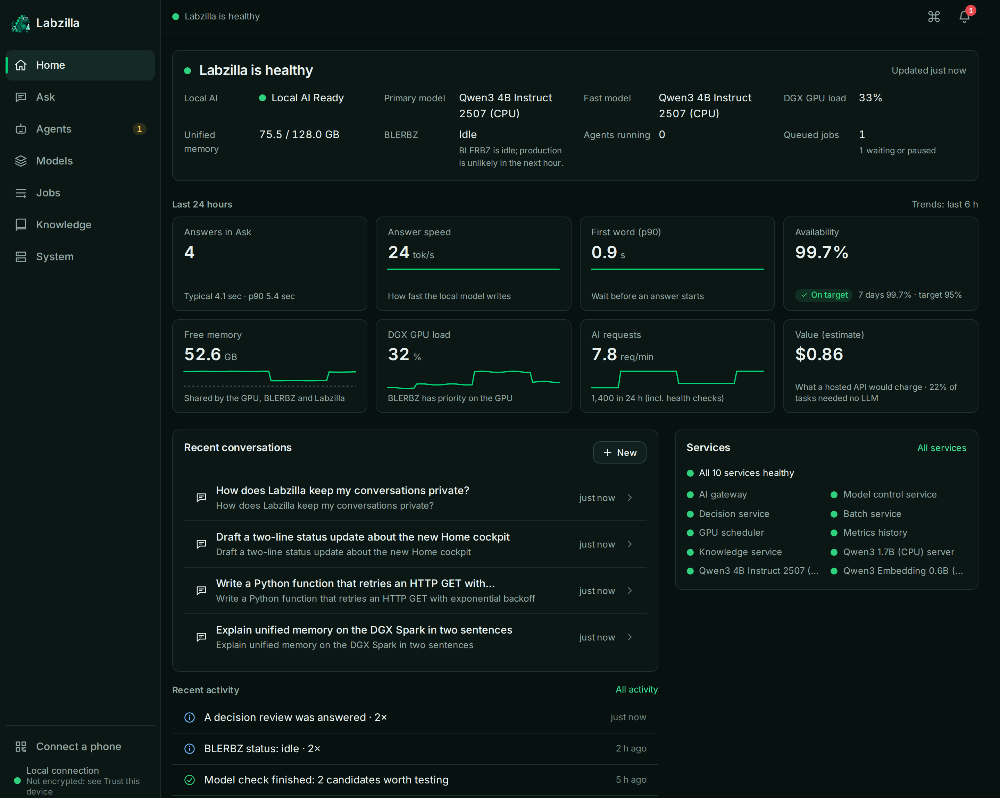
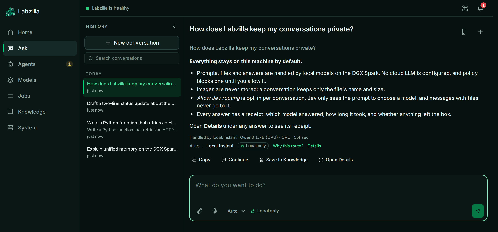

<p align="center">
  <picture>
    <source media="(prefers-color-scheme: dark)" srcset="assets/brand/labzilla-logo-dark.png">
    <source media="(prefers-color-scheme: light)" srcset="assets/brand/labzilla-logo.png">
    
  </picture>
</p>

<p align="center">
  <b>One machine. One cluster. One very large lizard.</b><br>
  <sub>The infrastructure and private AI platform behind <code>tiny-dgx</code>, a DGX Spark (GB10, arm64, 128 GB unified memory).</sub>
</p>

<p align="center">
  
  
  
  
  
  
</p>

---

## A look inside

<p align="center">
  
</p>
<p align="center"><sub><b>Home</b>: is it healthy, how fast and available is local AI, what is the DGX doing, and what happened. Every tile drills down.</sub></p>

<p align="center">
  
</p>
<p align="center"><sub><b>Ask</b>: private chat with local models. Every answer shows who answered, how fast, and that nothing left the box.</sub></p>

<p align="center"><sub>Demo data from the console's test harness (<code>lif/apps/console/e2e/readme_shots.mjs</code>), not from a live system.</sub></p>

---

labzilla is a monorepo with two projects that share one host, one cluster and one set of
local credentials:

| Project | What it is | Start here |
|---|---|---|
| **[`homelab/`](homelab/)** | The k3s platform: Longhorn storage, MinIO backups (on- and off-site), Prometheus + Grafana, MetalLB, Tailscale, all GitOps-managed by Argo CD | [homelab/README.md](homelab/README.md) |
| **[`lif/`](lif/)** | The **Local Intelligence Fabric**: an OpenAI-compatible gateway over local models, Decision Engineering (typed Jev decisions with calibrated escalation), a persistent knowledge layer for agents, model lifecycle, batch queue, and the **Labzilla Console** (web + phone UI). Runs on the platform | [lif/README.md](lif/README.md) |

## Use Labzilla (the console)

The **Labzilla Console** is the everyday way in: ask the local AI, watch the DGX, run model checks, approve
agent reviews and pause jobs, from a desktop browser or a phone on the home network.
**→ [https://labzilla.local](https://labzilla.local)** (also `https://labzilla.tiny-dgx.lan`)

**Fastest start, from any Linux or macOS machine:**

```bash
tools/labzilla          # checks this machine, checks Labzilla, installs its certificate (verified), opens the console
```

| Command | What it does |
|---|---|
| `labzilla` | Guided quick start: doctor → status → trust (if needed) → open |
| `labzilla status` | Console up and ready, HTTPS trusted on this machine; on the host also every service and whether local AI answers |
| `labzilla trust` | Downloads the Labzilla CA from the console, checks its SHA-256 fingerprint (against `--fingerprint`, the host's copy, or your confirmation) and installs it |
| `labzilla open` / `doctor` | Open the console; list what this machine has and needs |

`tools/setup.sh` puts `labzilla` on your PATH. Other devices (phones, Windows) use **Trust this device** in the console.

It is already deployed. Each new device needs the one-time steps below; steps 2 and 3 happen once per install.

| Step | Who / where | What to do |
|---|---|---|
| **1. Trust the certificate** | Each device, once | Copy `secrets/labzilla-ca.crt` from the Labzilla host, for example `scp <user>@labzilla.local:labzilla/secrets/labzilla-ca.crt .`, and install it as a trusted CA. **iPhone/iPad:** open the file, install the profile, then turn it on under *Settings → General → About → Certificate Trust Settings*. **Android:** *Settings → Security → Encryption & credentials → Install a certificate → CA certificate*. **macOS:** open it in Keychain Access and set *Always Trust*. **Windows:** double-click → *Install Certificate* → *Trusted Root Certification Authorities*. **Linux:** `sudo cp labzilla-ca.crt /usr/local/share/ca-certificates/ && sudo update-ca-certificates`. The CA is limited to `tiny-dgx.lan` and `labzilla.local` names, and it is public: never copy the `.key` |
| **2. Open the console** | Any browser | Go to **https://labzilla.local**. Phones and Macs find `.local` names on their own. If a Windows PC can't, add `192.168.68.72 labzilla.tiny-dgx.lan` to its hosts file and use `https://labzilla.tiny-dgx.lan` |
| **3. Create the admin (first run only)** | The host, then the browser | The console opens **Setup**. On the Labzilla host run `cat ~/labzilla/secrets/lif-console-setup.code`, enter that code, then choose your name and a passphrase of at least 10 characters. You land on *"Labzilla is ready"* → **Ask Labzilla** |
| **4. Connect a phone** | Desktop + phone | On the desktop, open **Connect a phone** in the sidebar or press `Ctrl/⌘+K`. Scan the QR code with the phone and check that both screens show the same 6-digit code, then click **Approve**. The phone opens straight to the prompt; remove phones under *Connect → Devices*. On the phone, *Share → Add to Home Screen* installs it as an app |

Everyday use: type in the command bar at the bottom (or press `/`). Plain questions go to the local model;
"why is the GPU busy?", "pause batch jobs" or "check for better coding models" are answered or offered as an action you confirm.

| If… | Then |
|---|---|
| The browser warns about the certificate | Step 1 isn't done on this device. Until it is, sign-in and Ask still work after you accept the warning; install, voice and notifications don't |
| `labzilla.local` doesn't resolve | Use `https://labzilla.tiny-dgx.lan` with a hosts entry (step 2). On the host, `systemctl --user status labzilla-mdns` publishes the name ([unit](homelab/host/systemd/labzilla-mdns.service)) |
| Setup says the setup code isn't configured | Run `lif/scripts/create-secrets.sh`, then `kubectl -n ai-system rollout restart deploy/gateway deploy/controller deploy/console` |
| The page doesn't load at all | `kubectl -n ai-system get pods -l app=console`. Deploy and rollback steps are in [CONSOLE → Deploy & access](lif/docs/CONSOLE.md#deploy--access) |

Design, security model and every screen: [lif/docs/CONSOLE.md](lif/docs/CONSOLE.md).

## Inside LIF

LIF has one rule: **don't generate when you only need to decide.** Every agent step goes to the cheapest
executor that can do it correctly, and the platform keeps measuring whether that is still true.

```text
 agent step ──► CODE ──────► JEV ────────────► LOCAL MODEL ──► KIMI K3 ──► HUMAN / SAFE DEFAULT
               exact        bounded judgment   generation or   hard        irreversible or
               results      (confidence ≥ the   uncertain       cases       unresolved
                            decision's calibrated cases          (opt-in)
                            threshold)
```

| Capability | What it does | Docs |
|---|---|---|
| **Gateway** | One OpenAI-compatible endpoint with logical models (`local/default`, `local/auto`, …), fallbacks, and yielding to the primary workload | [lif/README.md](lif/README.md) |
| **Decision Engineering** | Mines agent traces for decisions hidden in LLM calls. Turns them into versioned Jev questions that are linted, tested, shadowed, calibrated per decision and promoted only by a person. Escalates by confidence | [DECISION_ENGINEERING](lif/docs/DECISION_ENGINEERING.md) |
| **Knowledge layer** | Typed Markdown repos of decisions, evidence, incidents and methods. A graph with context assembly, and an MCP server so agents resume work with provenance | [KNOWLEDGE](lif/docs/KNOWLEDGE.md) |
| **Model lifecycle** | Hugging Face discovery → benchmark → canary → promotion, with rollback | [MODEL_LIFECYCLE](lif/docs/MODEL_LIFECYCLE.md) |
| **Labzilla Console** | The everyday UI for desktop and phone: Ask with streaming and routing receipts, health in plain language, models, jobs, agents, knowledge, QR phone pairing | [CONSOLE](lif/docs/CONSOLE.md) |
| **Control Center** | Expert view: overview, models, decision engineering (opportunities, calibration, cascades, traces, review queue), knowledge | [OPERATIONS](lif/docs/OPERATIONS.md) |

Measured 2026-10-01 on 267 labelled agent decisions: Jev was right 94.4% of the time, at a median of 167 ms.
At a 0.9 threshold, 68% of cases resolved automatically, all correctly. The rest escalated
([benchmark](lif/benchmarks/decision-engineering/README.md)).

## Repository map

```text
labzilla/
├── homelab/            k3s platform (Argo CD app-of-apps, Helm values, host prep, backup)
│   ├── argocd/         root.yaml → apps/   (a push to main is a deploy)
│   ├── monitoring/     Prometheus/Grafana values, rules, dashboards
│   ├── networking/     MetalLB, Tailscale, local-ca/ (LAN HTTPS certificate)
│   ├── longhorn/  minio/  backup/  host/
│   ├── scripts/        every setup step, repeatable
│   └── docs/
├── lif/                Local Intelligence Fabric
│   ├── lif/            Python package (gateway, controller, decision, knowledge, batch, cli, …)
│   ├── decision-packages/  versioned Jev questions + labelled tests (never edited in place)
│   ├── deploy/k8s/     manifests (kustomization.yaml at lif/)
│   ├── apps/console/   Labzilla Console PWA (Preact + TypeScript; backend in lif/lif/console)
│   ├── config/ evals/  apps/control-center/
│   ├── benchmarks/     public, reproducible benchmarks
│   ├── knowledge/      agent repos + knowledge package registry (typed Markdown; `knowledge` CLI, MCP)
│   ├── tests/
│   └── docs/
├── assets/brand/       logo (light + dark), mark, social card
├── tools/              setup.sh, check-private.py (the public-repo guard)
├── .githooks/          pre-commit → tools/check-private.py
│
├── secrets/            🔒 credentials          (git-ignored, README only)
├── private/            🔒 sensitive docs/data  (git-ignored, README only)
├── personal/           🔒 your notes           (git-ignored, README only)
└── .env.local          🔒 TYPE_SAFE_JEV_API_KEY, optional MOONSHOT_API_KEY (git-ignored)
```

## Quickstart

```bash
git clone git@github.com:MoRohn/labzilla.git ~/labzilla && cd ~/labzilla
tools/setup.sh            # enables the pre-commit guard, creates the private roots, builds lif/.venv
```

Then follow the project you need:

- **Use Labzilla from a browser or phone:** [Use Labzilla](#use-labzilla-the-console) above
- **Platform from scratch:** [homelab/README.md → "The setup, in seven acts"](homelab/README.md#the-setup-in-seven-acts)
- **Deploy or operate LIF:** [lif/docs/DEPLOYMENT.md](lif/docs/DEPLOYMENT.md) and [lif/docs/OPERATIONS.md](lif/docs/OPERATIONS.md)
- **Call the AI gateway from an app:** [lif/README.md → Quickstart](lif/README.md#quickstart-for-application-developers)
- **Make an agent decide instead of generate:** `local-ai agent audit` finds the decisions hidden in its LLM calls,
  and the SDK gives you `decide()` vs `generate()` ([DECISION_ENGINEERING](lif/docs/DECISION_ENGINEERING.md))
- **Use it from an AI coding agent:** `.mcp.json` registers two MCP servers: `lif-knowledge` (context, sessions)
  and `lif-decisions` (`classify_operation`, `decide`, `decision_lint`, `agent_audit`)

## How changes reach the cluster

| What changed | How it deploys |
|---|---|
| `homelab/argocd/apps/**`, `homelab/monitoring/**`, `homelab/networking/metallb/config/**` | **Push to `main`.** Argo CD syncs within ~3 minutes |
| `lif/**` | By hand: build → push to the local registry → `kubectl apply` ([DEPLOYMENT](lif/docs/DEPLOYMENT.md)). An optional Argo CD app is in `homelab/argocd/templates/` |
| Host prep, Helm installs, secrets | Scripts in `homelab/scripts/`, `homelab/host/`, `lif/scripts/` |

`main` is production. Review before you push.

## What stays private

This repository is **public**. Three git-ignored roots keep everything else on the machine:

| Root | For | Examples |
|---|---|---|
| [`secrets/`](secrets/README.md) | Credentials | MinIO, Grafana, Tailscale, off-site env files; LIF API keys |
| [`private/`](private/README.md) | Real project material that must not be published | LIF host/network audit, security posture, primary-workload integration, production readiness, benchmarks captured from production |
| [`personal/`](personal/README.md) | Your own notes | Notes, drafts, diagnostics, saved AI-assistant memory or reasoning |

Three layers back this up:

1. **`.gitignore`** ignores each root wholesale. Only its README is tracked, so a new file is private by default.
2. **The pre-commit guard** ([`tools/check-private.py`](tools/check-private.py)) rejects staged files that sit in a private root, look like keys or dotenv files, contain any credential currently stored in `secrets/` or `.env.local`, or match well-known token formats. It never prints the values.
3. **`python3 tools/check-private.py --all`** audits every tracked file. Run it before a push.

Public docs that refer to private ones mark the link *(private, local only)*.
Claude Code's own memory and transcripts live in `~/.claude/`, outside the repo.

## Conventions

- **Commits:** Conventional Commits with a scope: `feat(monitoring): …`, `fix(lif): …`, `docs(homelab): …`.
- **Pin everything:** Helm chart versions, image tags, Python dependencies.
- **Scripts** are idempotent, run from their project folder, and find `secrets/` at the repo root.
- **Memory is shared:** the GPU and every pod draw from one 128 GB pool. Give every workload limits.
  Talk to the host GPU scheduler (`gpusched`) before using the GPU.
- **AI assistants:** see [CLAUDE.md](CLAUDE.md) for the rules agents follow in this repo.

---

<p align="center">
  <br>
  <sub>Stomping on single points of failure since 2026. (Except the one node. We don't talk about the one node.)</sub>
</p>
